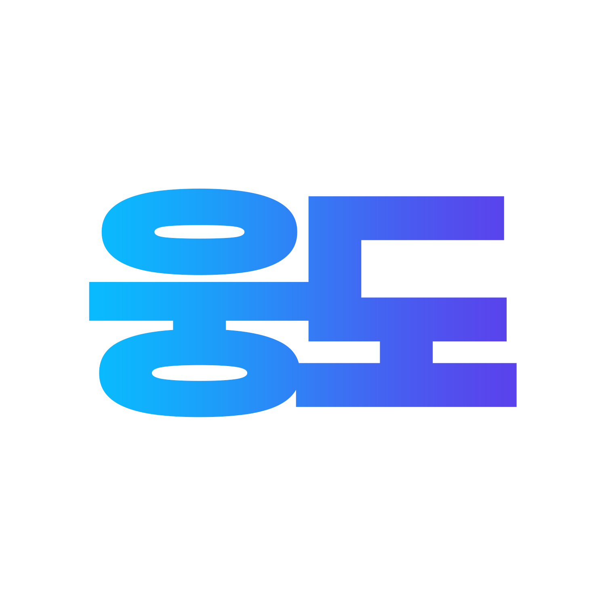

    
    <h1 style="font-weight:800">🐻 Woongdo 📚</h1>

> 단국대학교 부속 소프트웨어 고등학교 도서관은 책을 검색, 대출, 반납하기를 비효율적인 방식으로 진행합니다.
>
> '웅도'는 본교 학우들, 선생님들이 앞서 말씀드린 Flow들을 조금 더 편리하고 쉽게할 수 있도록 하기 위하여 개발하게 되었습니다.
>
> 본 프로젝트는 민감한 정보를 포함하고 있기에, 오픈소스로 진행되지 않았습니다.
>
> <a href="https://woongdo.kro.kr">여기를 클릭하여 웅도에 접속해보세요! 😁</a>

<h1 style="font-weight:600">Bug report / FeedBack</h1>

> ### woongdo@protonmail.com

서비스를 이용하다가 생긴 버그나 추가했으면 하는 기능들은 위에 메일로 보내주시거나, 이슈를 남겨주세요.

<h1 style="font-weight:600">Project Stack</h1>
<ul>
    <li><b>TypeScript</b></li>
    <li><b>MySQL</b></li>
</ul>

<h1 style="font-weight:600">API</h1>

본교 학우분들이 '웅도'를 크롤링하는 것은 괜찮습니다만, 다른 사용자들이 사이트를 이용하는 데에 지장이 없는 수준으로 부탁드리겠습니다.

또한, 사이트 레이아웃은 사전 예고 없이 갑작스럽게 변경될 수 있으며 그럴 때마다 크롤러가 오작동할 수 있으므로, <b><i>공식적으로 지원하는 API를 사용하시는 것을 권장드립니다.</i></b>

<a href="https://github.com/DKSH-WoongDo/Introduce-Woongdo/blob/main/docs/api/README.md">자세한 사항은 API 문서를 확인해주세요.</a>

<h1 style="font-weight:600">Recruit</h1>

> ### woongdo@protonmail.com

본교에 재학 중인 학우 분들 중, 웅도 개발팀에 합류하고 싶으신 분들은 위에 메일로 자신의 이름과 학번, 포트폴리오를 첨부하여 보내주세요.

웅도 개발팀은 인재분들을 항상 기다리고 있습니다.

    <b>Made with ❤, from Woongdo Team</b>

